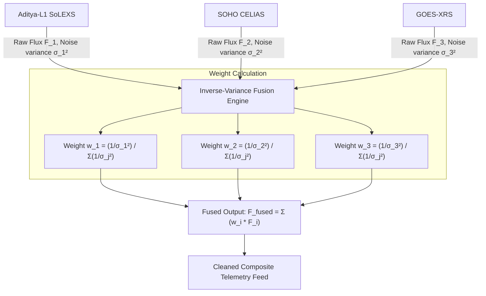

# 🧠 SuryaDrishti AI & Neural Schema Architecture

This document presents the detailed architectural and data-flow representations of the Machine Learning and Physics-Informed Neural Network (PINN) systems implemented in **SuryaDrishti v3.0**.

---

## 1. End-to-End System Pipeline

The diagram below shows how raw telemetry data from Aditya-L1 is processed, passed through feature extraction, fed to the RandomForest Classifier and the PINN Loss Engine, explained via SHAP, and finally served to the 3D Operator Dashboard.

```mermaid
flowchart TD
    subgraph Data Sources
        A1[Aditya-L1 SoLEXS<br/>Soft X-Rays: 1-15 keV] -->|1s Cadence| F1[FastAPI Telemetry Stream]
        A2[Aditya-L1 HEL1OS<br/>Hard X-Rays: 10-150 keV] -->|1s Cadence| F1
        A3[GOES / SOHO] -->|Fallback / Cross-Cal| SF[Multi-Satellite Sensor Fusion]
    end

    subgraph Preprocessing & Feature Extraction
        F1 --> SF
        SF -->|Inverse-Variance Weights| EX[5-Feature Extractor]
        EX -->|10-Min Sliding Window| F_Mean[1. Mean Flux]
        EX -->|10-Min Sliding Window| F_Std[2. Standard Deviation]
        EX -->|10-Min Sliding Window| F_Hard[3. Spectral Hardness Ratio]
        EX -->|10-Min Sliding Window| F_Slope[4. Linear Derivative Slope]
        EX -->|10-Min Sliding Window| F_QPP[5. FFT QPP Power]
    end

    subgraph AI Core
        F_Mean & F_Std & F_Hard & F_Slope & F_QPP --> RF[RandomForest Core<br/>500 Trees / Balanced Weights]
        F_Mean & F_Std & F_Hard & F_Slope & F_QPP --> PINN[PINN Loss Engine<br/>Physics-Informed Neural Net]
    end

    subgraph Explainability & Validation
        RF --> SHAP[SHAP Explainability Layer<br/>Shapley Game-Theory Values]
        PINN --> PDE[PDE Loss Constraints<br/>Klimchuk Coronal Loop Equation]
        PDE -->|Smooth Correction| F_Fused[Physics-Corrected P_flare]
    end

    subgraph Operator Dashboard
        F_Fused --> Dash[3D Dashboard UI]
        SHAP -->|Red/Blue Bars| Dash
        Dash -->|WebSocket Feed| Chat[Gemini AI Space Weather Assistant]
    end

    style A1 fill:#0ea5e9,stroke:#0284c7,color:#fff
    style A2 fill:#f97316,stroke:#ea580c,color:#fff
    style RF fill:#6366f1,stroke:#4f46e5,color:#fff
    style PINN fill:#ec4899,stroke:#db2777,color:#fff
    style SHAP fill:#10b981,stroke:#059669,color:#fff
    style Dash fill:#0f172a,stroke:#1e293b,color:#fff
```



---

## 2. RandomForest Classifier Architecture (Nowcasting & Forecasting)

The forecasting model predicts whether a solar flare will occur **30 minutes in advance** ($T+30$). To mitigate severe class imbalance (flares are only 1.51% of the telemetry windows), we employ a balanced class-weighted tree architecture.

```mermaid
graph TD
    In[10-Minute Sliding Window of Telemetry] --> Feat[Extract 5 Precursor Features]
    Feat --> RF[RandomForest Ensemble]
    
    subgraph Forest Ensemble
        RF --> Tree1[Decision Tree 1]
        RF --> Tree2[Decision Tree 2]
        RF --> TreeN[Decision Tree 500]
        
        Tree1 --> Vote1[Class Probability]
        Tree2 --> Vote2[Class Probability]
        TreeN --> VoteN[Class Probability]
    end

    subgraph Balanced Class Weighting
        Vote1 & Vote2 & VoteN --> Agg[Weighted Average Vote]
        Note["Balanced Weights: Loss is weighted inversely<br/>proportional to class frequencies.<br/>w_j = n_samples / (n_classes * n_samples_j)"]
        Agg -.-> Note
    end

    Agg --> Out[P(M/X-Class Flare) %]
```

---

## 3. Physics-Informed Neural Network (PINN) Loss Architecture

Unlike a pure black-box neural network that only fits the data, our **Physics-Informed Neural Network (PINN)** is constrained by the 1D Klimchuk coronal loop hydrodynamic equations. This forces the model to respect the laws of thermodynamics (conservation of mass and energy) in its outputs.

```mermaid
flowchart TD
    Inputs[Coordinates: Loop position s, Time t] --> Net[Multi-Layer Perceptron MLP]
    Net --> Outputs[Predicted Fields: Temperature T, Density n, Pressure p]
    
    subgraph Data Loss
        Outputs --> L_data[L_data: Mean Squared Error vs. SoLEXS/HEL1OS observations]
    end
    
    subgraph Physics Loss (PDE Constraint)
        Outputs --> Diff[Calculate Automatic Derivatives:<br/>dT/dt, dT/ds, dn/dt, dn/ds, dp/ds]
        Diff --> PDE[Evaluate Coronal Loop PDE:<br/>dE/dt - H + n²Λ(T) + dF_c/ds]
        PDE --> L_phys[L_physics: Physics Residual Norm]
    end
    
    subgraph Boundary Loss
        Outputs --> L_bc[L_boundary: Chromospheric boundary condition constraints]
    end

    L_data & L_phys & L_bc --> Loss[Total Loss Function]
    Loss --> Backprop[Backpropagation & SGD Optimizer]
    Backprop -->|Update Weights| Net

    classDef lossStyle fill:#fef08a,stroke:#eab308,color:#854d0e;
    class L_data,L_phys,L_bc,Loss lossStyle;
```

---

## 4. Multi-Spacecraft Sensor Fusion Architecture

This schema combines data from three distinct vantage points (Aditya-L1 at Lagrange 1, SOHO at Lagrange 1, and GOES in Geostationary Orbit) using inverse-variance weights to provide a failure-tolerant baseline.


