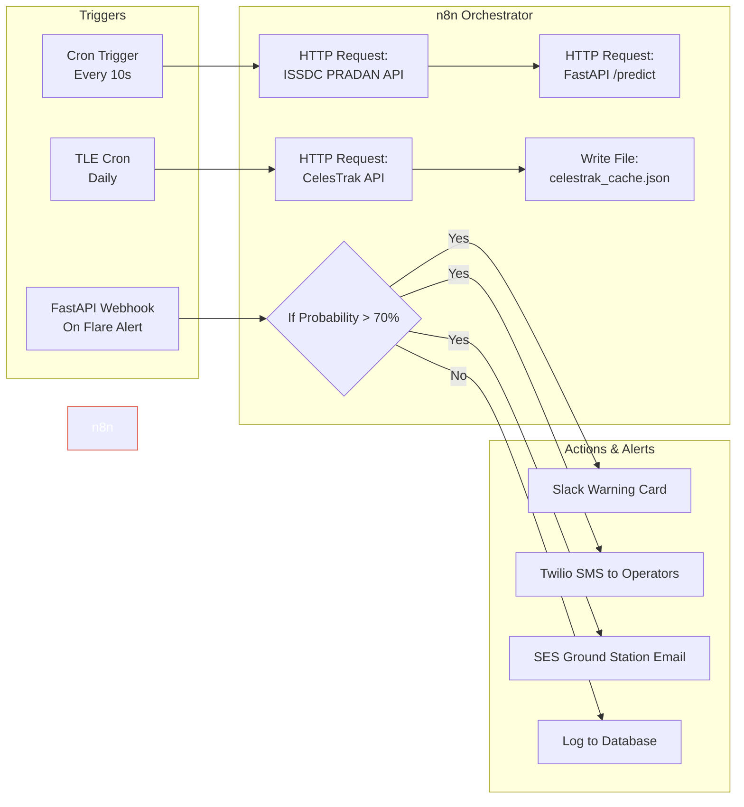

# 🌐 n8n Space Weather Workflow Orchestration

This document describes how to use **n8n** to automate, trigger, and orchestrate the **SuryaDrishti** solar flare early warning system.

---

## 1. n8n System Architecture

Using n8n allows us to decouple data polling, model inference, and notification routing from the core application logic.



---

## 2. Setting Up n8n Locally

n8n can be run using Docker or Node.js package manager:

### Option A: Using npm (Fastest local setup)
```bash
# Install n8n globally
npm install n8n -g

# Start n8n
n8n start
```
Once started, open your browser and navigate to: **`http://localhost:5678`**

### Option B: Using Docker Compose
Add this service block to your existing `docker-compose.yml`:
```yaml
  n8n:
    image: docker.n8n.io/n8nio/n8n
    restart: always
    ports:
      - "5678:5678"
    environment:
      - N8N_HOST=localhost
      - N8N_PORT=5678
      - N8N_PROTOCOL=http
    volumes:
      - n8n_data:/home/node/.n8n

volumes:
  n8n_data:
```

---

## 3. Workflow Details

### 🔄 Ingestion & Inference Pipeline
1. **Interval Trigger:** Runs every 10 seconds.
2. **HTTP Request Node:** Requests `/telemetry` from `http://localhost:8000`.
3. **FastAPI Inference Node:** POSTs the raw telemetry to `http://localhost:8000/predict`.
4. **Conditional Switch:** Inspects `prediction.probability`. If it exceeds 70%, redirects execution flow to the Alert Router channel.

### 📡 CelesTrak TLE Automation
1. **Cron Trigger:** Runs at 00:00 UTC daily.
2. **HTTP Request Node:** Downloads TLE data from `https://celestrak.org/NORAD/elements/gp.php?GROUP=active&FORMAT=tle`.
3. **File Write Node:** Overwrites local `celestrak_cache.json` in the frontend directory. This ensures the 3D Satellite Map tab always has up-to-date orbital vectors.

### 🚨 Dynamic Multi-Channel Alert Router
1. **Webhook Trigger:** Receives alert details.
2. **Slack Node:** Formats a rich JSON block warning satellite operators about the high-energy flux.
3. **Email Node (SMTP):** Dispatches automated PDF reports containing current SHAP feature values and operator directives.
